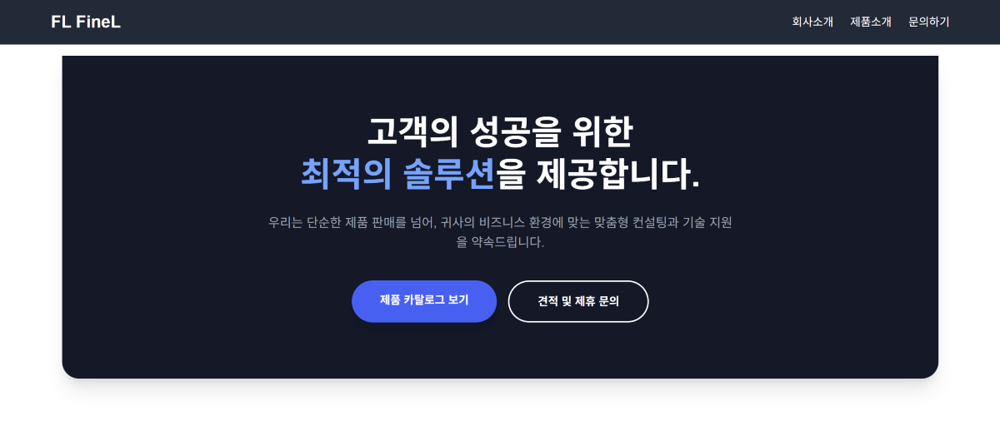

# Finel

산업용 공압 부품 전문 기업 **파인엘(Finel)** 웹사이트입니다.  
제품 카탈로그, 제품 검색, 견적/제휴 문의, 관리자용 제품·카테고리·문의 관리를 제공하는 풀스택 프로젝트입니다.



## 주요 기능

- 제품 목록, 상세 페이지, 카테고리별 제품 탐색
- 제품명 기반 검색
- 견적 및 제휴 문의 접수
- 관리자 로그인과 인증 쿠키 기반 보호 페이지
- 관리자 제품 등록, 수정, 삭제, 노출 여부 관리
- 관리자 카테고리 관리
- 관리자 문의 내역 조회 및 삭제
- Cloudinary 기반 제품 이미지 업로드
- sitemap, robots, canonical, Open Graph 메타데이터 구성

## 기술 스택

| 영역 | 기술 |
| --- | --- |
| Frontend | Next.js 16, React 19, TypeScript, Tailwind CSS 4 |
| Backend | Java 21, Spring Boot 3.5, Spring Security, Spring Data JPA |
| Database | PostgreSQL, Flyway |
| Infra / External | Cloudinary, SMTP Mail |
| Tooling | ESLint, Gradle Wrapper |

## 프로젝트 구조

```text
.
├── frontend/               # Next.js App Router frontend
│   ├── src/app/            # pages, layouts, metadata, route-level UI
│   ├── src/components/     # shared UI components
│   ├── src/features/       # domain-specific frontend features
│   ├── src/hooks/          # shared client-side hooks
│   ├── src/lib/api/        # Spring API client wrappers
│   └── public/             # static assets
├── backend/                # Spring Boot REST API
│   ├── src/main/java/      # domain-based backend packages
│   ├── src/main/resources/ # profiles, Flyway migration
│   └── src/test/java/      # backend tests
├── docs/                   # migration notes and API specs
└── frontend/.env.example   # local frontend environment template
```

## 시작하기

### 요구 사항

- Node.js 20 이상 권장
- Java 21
- PostgreSQL
- npm

### 1. 저장소 클론

```bash
git clone https://github.com/chanbonggg/finel.git
cd finel
```

### 2. 환경변수 설정

```bash
cp .env.example .env
cp frontend/.env.example frontend/.env.local
```

환경변수는 실행 주체별로 분리한다.

- 루트 `.env`: Spring Boot가 읽는 DB, JWT, 메일, Cloudinary 등 서버 설정
- `frontend/.env.local`: Next.js가 읽는 API URL, 사이트 URL, Next 캐시 갱신 설정

기존 루트 `.env`가 있다면 유지하고, `frontend/.env.local`에는 API URL 설정을 추가하면 된다. Spring은 `backend/.env`와 루트 `.env`를 순서대로 읽는다.

로컬 기본값은 다음 구성을 가정합니다.

```text
Frontend: http://localhost:3000
Backend:  http://localhost:8080
Postgres: jdbc:postgresql://localhost:5432/finel
```

실제 운영 비밀값, DB 비밀번호, JWT secret, SMTP 계정, Cloudinary secret은 `.env`에만 보관하고 커밋하지 않습니다.

기존 사용 DB를 로컬 Spring 서버에 연결하는 동안에는 루트 `.env`에 `SPRING_FLYWAY_ENABLED=false`를 둡니다. 이 경우 Flyway는 실행되지 않고 JPA가 기존 스키마와 매핑이 일치하는지만 검증합니다. 기존 DB에 Flyway baseline을 기록하는 작업은 백업과 스키마 대조 후 별도로 승인해야 합니다.

### 3. 프론트엔드 실행

```bash
cd frontend
npm ci
npm run dev
```

브라우저에서 [http://localhost:3000](http://localhost:3000)을 엽니다.

### 4. 백엔드 실행

```bash
cd backend
./gradlew bootRun --args="--spring.profiles.active=devdb"
```

Windows PowerShell에서는 다음 명령을 사용할 수 있습니다.

```powershell
cd backend
.\gradlew.bat bootRun --args="--spring.profiles.active=devdb"
```

## 환경변수

| 이름 | 설명 |
| --- | --- |
| `NEXT_PUBLIC_API_BASE_URL` | 브라우저에서 호출할 Spring API 주소 |
| `SERVER_API_BASE_URL` | Next.js 서버 런타임에서 호출할 Spring API 주소 |
| `NEXT_PUBLIC_SITE_URL` | canonical, sitemap 등에 사용하는 공개 사이트 주소 |
| `REVALIDATE_SECRET` | Spring이 Next 캐시 갱신을 호출할 때 두 서비스가 공유하는 비밀값 |
| `FRONTEND_ORIGIN` | Spring CORS 허용 origin |
| `DB_URL` | PostgreSQL JDBC URL |
| `DB_USERNAME` | DB 사용자명 |
| `DB_PASSWORD` | DB 비밀번호 |
| `JWT_SECRET` | 관리자 인증 JWT 서명 secret, 최소 32바이트 권장 |
| `AUTH_COOKIE_SECURE` | HTTPS 환경에서 인증 쿠키 Secure 적용 여부 |
| `AUTH_COOKIE_DOMAIN` | 운영 도메인 쿠키 공유가 필요할 때 설정 |
| `MAIL_*` | 문의 알림 메일 SMTP 설정 |
| `CLOUDINARY_*` | 제품 이미지 업로드용 Cloudinary 설정 |

`NEXT_PUBLIC_CLOUDINARY_*`, `DATABASE_URL`, `EMAIL_USER`, `EMAIL_PASS`는 이전 구현의 변수명이다. 현재 Spring API는 `CLOUDINARY_*`, `DB_*`, `MAIL_*`만 사용한다.

전체 예시는 [frontend/.env.example](frontend/.env.example)을 확인하세요.

## 검증

프론트엔드 린트:

```bash
cd frontend
npm run lint
```

프론트엔드 빌드:

```bash
cd frontend
npm run build
```

백엔드 테스트:

```bash
cd backend
./gradlew test
```

Windows PowerShell:

```powershell
cd backend
.\gradlew.bat test
```

## API 개요

| 영역 | 주요 경로 |
| --- | --- |
| Auth | `POST /api/auth/login`, `GET /api/auth/logout`, `GET /api/auth/verify`, `GET /api/auth/csrf` |
| Products | `GET /api/products`, `GET /api/products/{id}`, `GET /api/products/search`, `POST /api/products`, `PATCH /api/products/{id}`, `DELETE /api/products/{id}` |
| Categories | `GET /api/categories`, `GET /api/categories/{id}`, `POST /api/categories`, `DELETE /api/categories?id=` |
| Inquiries | `POST /api/inquiries`, `GET /api/inquiries`, `DELETE /api/inquiries/{id}` |
| Public Meta | `GET /api/sitemap-data` |

자세한 요청/응답 계약은 [docs/api-contract.md](docs/api-contract.md)에 정리되어 있습니다.

## 보안 메모

- `.env`와 실제 비밀값은 저장소에 커밋하지 않습니다.
- 관리자 인증은 `auth_token` httpOnly 쿠키와 CSRF 토큰을 사용합니다.
- 공개 문의 API를 제외한 관리자 변경 요청은 인증과 CSRF 검증이 필요합니다.
- 운영 환경에서는 `AUTH_COOKIE_SECURE=true`를 사용하고 HTTPS 배포를 전제로 합니다.
- Cloudinary API secret은 절대 `NEXT_PUBLIC_*` 환경변수로 노출하지 않습니다.
- 로컬에서는 `AUTH_COOKIE_SECURE=false`, `AUTH_COOKIE_DOMAIN` 미설정을 사용합니다.

## 문서

- [API 계약 문서](docs/api-contract.md)
- [마이그레이션 런북](docs/migration-runbook.md)
- [백엔드 README](backend/README.md)

## 라이선스

현재 라이선스 파일이 포함되어 있지 않습니다. 공개 저장소로 운영하려면 배포 전에 라이선스 정책을 확정해 `LICENSE` 파일을 추가하세요.
